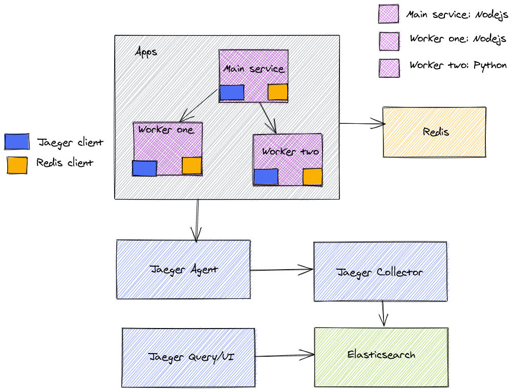
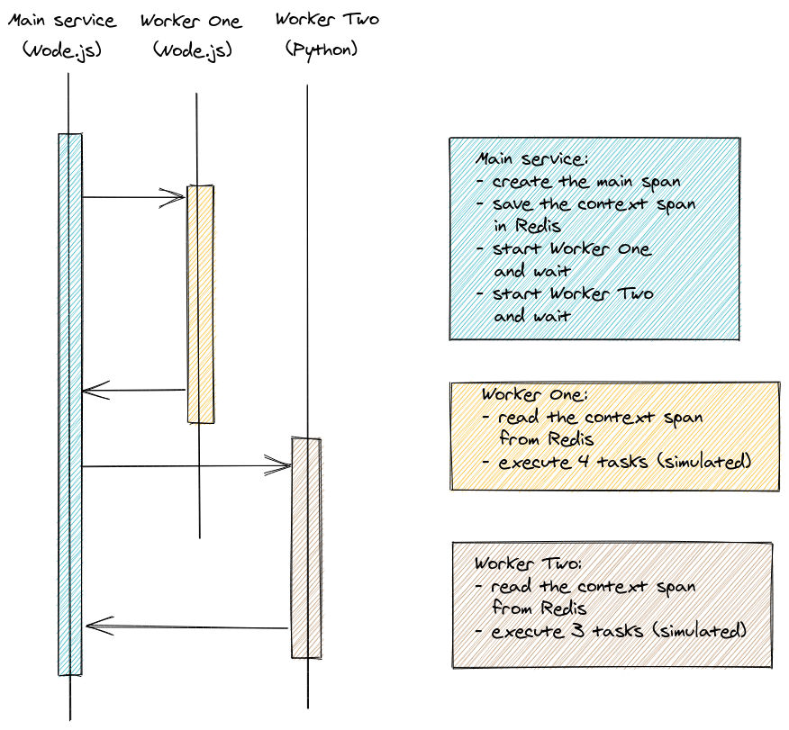
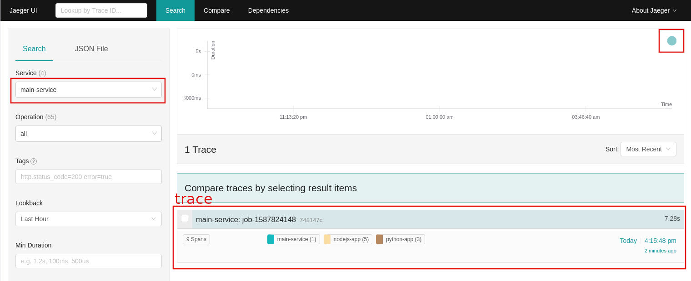
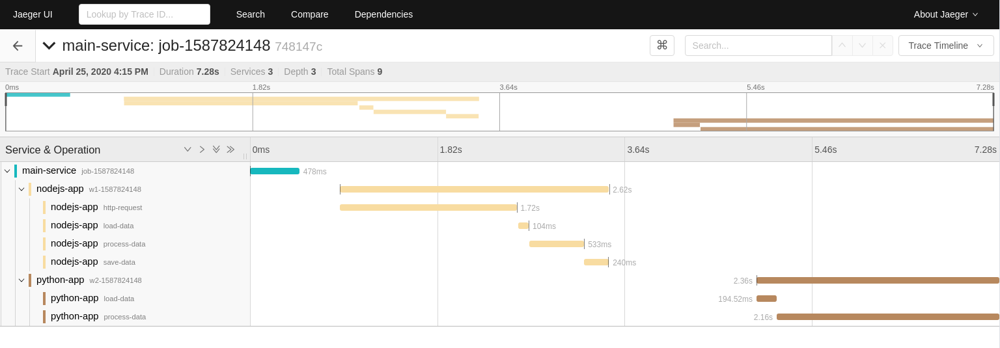
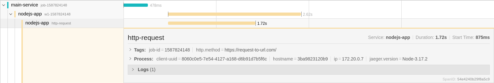

# Distributed tracing using Redis as message queue

An example of distributed tracing with Redis as message queue for propagate the context.

## Description 

[TODO]

## Project requirements
- Docker compose 1.25.4
- GNU/Linux

## Project setup 
1. Clone the repo and open the root folder

1. Start all microservices with the command:

        docker-compose -f docker-compose.yml up -d --build

1. Visit http://localhost:16686 to view traces


## Project architecture

The system is composed by the follow modules: 
- Apps (that contains two NodeJS apps and a Phyton app)
- Redis 
- Jaeger Agent
- Jaeger Collector
- Jaeger Query/UI
- Elasticsearch

Each module is deployed by a docker container through a docker-compose.

### Tracing infrastructure
&nbsp;

&nbsp;

### End to end transaction cycle
&nbsp;
 
&nbsp;

### Tracing details

## Redis as message bus

As described above, the 3 apps: *main-service*, *worker-one* and *worker-two* use Redis to pass the span context.   
The context is saved in Redis using a *job-id* as key. 

### Main Service code (NodeJS)

At startup the *main-service* creates a new span and saves the context it in Redis.

```
    /* apps/nodejs-src/app.js */
    const jobId = Math.floor(new Date() / 1000)
    const mainSpan = await tracer.createSpan(`job-${jobId}`)
    ...
    await tracer.saveContext(jobId, mainSpan.context())
```

```
    /* apps/nodejs-src/tracer.js */
    saveContext(id, context) {
        return new Promise((resolve, reject) => {
            var map = {}
            this.tracer.inject(context, opentracing.FORMAT_TEXT_MAP, map)
            redis.set(id, JSON.stringify(map), (err) => {
                if (err) { reject(err) }
                resolve()
            })
        })
    }
```

Then it executes the 2 workers launching them through two separated shell commands.

```
    /* apps/nodejs-src/app.js */ 
    async function taskOne(jobId) {
        await runCommand(`node /usr/src/nodejs-app/worker.js ${jobId}`)
    }

    async function taskTwo(jobId) {
        await runCommand(`python3 /usr/src/python-app/worker.py ${jobId}`)
    }
```

### Worker apps code

The two workers receive in input just a job-id, but not the context span, that is retrieved through Redis instead.

Below the code used from the two apps to read the span context from Redis. 

**Worker-one (NodeJS code)**
```
    /* apps/nodejs-src/tracer.js */
    async createContinuationSpan(spanName, contextId) {
        return this.createSpan(
            spanName, 
            this.extractSpan(await this.loadContext(contextId))
        )
    }
    
    extractSpan(context) {
        if (context) {
            return this.tracer.extract(opentracing.FORMAT_TEXT_MAP, context)
        }
        return undefined
    }
    
    loadContext(id) {
        return new Promise((resolve, reject) => {
            if (!id) resolve(undefined)
            redis.get(id, (err, reply) => {
                if (err) {
                    reject(err)
                }
                if (reply) { 
                    resolve(JSON.parse(reply.toString()))
                } else {
                    resolve(undefined)
                }
            })
        })
    }
```

**Worker-two (Python code)**
```
    def create_continuation_span(self, span_name, context_id):
        return self.create_span(
            span_name, 
            self.extract_span(self.load_context(context_id))
        )
        
    def load_context(self, id):
        if id is None:
            return None
        print('id: {}'.format(id) )
        byte = self.redis_cli.get(id)
        if byte is None:
            return None
        try:
            context = json.loads(byte.decode("utf-8"))
        except Exception as e:
            return e
        return context

    def extract_span(self, context):
        if (context is None):
            return None
        return self.tracer.extract(
            format=Format.TEXT_MAP,
            carrier=context
        )
```

## Tracing results: Jaeger UI

[TODO]

Below some examples of a trasaction and a trace generated by the 3 apps.
&nbsp;
&nbsp;
&nbsp;
&nbsp; 
&nbsp;
&nbsp; 

## References

### Medium articles
- https://medium.com/swlh/microservices-observability-with-distributed-tracing-32ae467bb72a
- https://medium.com/@codeboten/redis-tributed-distributed-tracing-through-redis-9b671187da47
- https://medium.com/opentracing/announcing-python-opentracing-2-0-0-release-f4ee33de25ce

### Jaeger clients
- https://www.jaegertracing.io/docs/1.17/client-libraries/
- https://github.com/jaegertracing/jaeger-client-python
- https://github.com/jaegertracing/jaeger-client-node
- https://opentracing-python.readthedocs.io/en/latest/api.html

### Opentracing 
- https://opentracing.io/guides/javascript/
- https://opentracing.io/docs/overview/tags-logs-baggage/
- https://github.com/opentracing/opentracing-python
- https://github.com/yurishkuro/opentracing-tutorial/tree/master/python/lesson01
- https://opentracing.io/docs/overview/spans/
- https://opentracing.io/guides/python/tracers/
