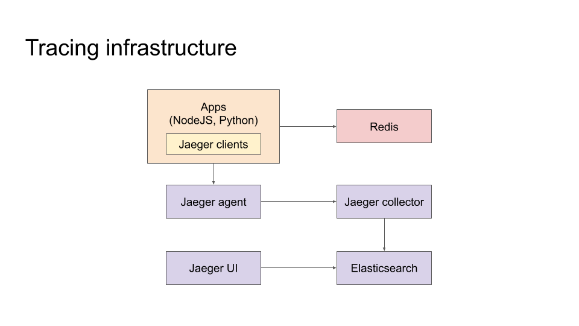
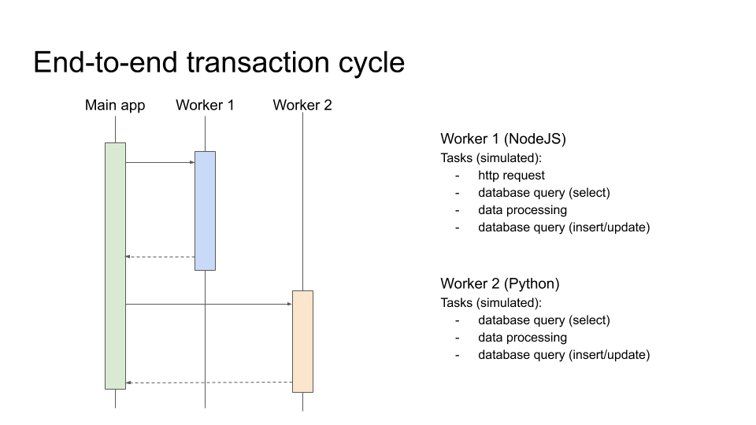

# Distributed tracing using Redis as message bus

## Description 

A simple example of distrubuted tracing using Redis as message bus for trasportation system.

## How to start the project
1. Clone the repo and open the root folder in an IDE like *Visual Studio Code*.

1. Start all microservices with the command:

        docker-compose -f docker-compose.yml up -d --build

1. Visit http://localhost:16686 to view traces.

## Project architecture

In the project we will use the follow technologies:
- NodeJS
- Python 
- Redis
- Jaeger (agent, collector, query)
- Opentracing
- Elasticsearch
- Docker-compose

### Tracing infrastructure

 

### End to end transaction cycle

 

## Redis as message bus

The 2 apps Worker-1 (NodeJS) and Worker-2 (Python) use Redis to pass the span context. The context is saved using the Job ID as key. 

### NodeJS code

The follow code is used to read and write the span context in Redis.

```
function saveContext(id, context) {
    return new Promise((resolve, reject) => {
        var map = {}
        tracer.inject(context, opentracing.FORMAT_TEXT_MAP, map)
        redis.set(id, JSON.stringify(map), (err) => {
            if (err) { reject(err) }
            resolve()
        })
    })
}

function loadContext(id) {
    return new Promise((resolve, reject) => {
        if (!id) resolve(undefined)
        redis.get(id, (err, reply) => {
            if (err) {
                reject(err)
            }
            if (reply) { 
                resolve(JSON.parse(reply.toString()))
            } else {
                resolve(undefined)
            }
        })
    })
}

function extractContext(tracer, context) {
    if (context) {
        return tracer.extract(opentracing.FORMAT_TEXT_MAP, context)
    }
    return undefined
}

async function createContinuationSpan(tracer, spanName, id = undefined) {
    const incomingSpanContext = extractContext(tracer, await loadContext
    ... 
}
```

### Python code

The follow code is used to read the span context from Redis.

```
def create_continuation_span(tracer, span_name, id):
    incoming_span_context = extract_context(tracer, load_carrier(id))
    ...

def load_carrier(id):
    if id is None:
        return None
    byte = redis_cli.get(id)
    if byte is None:
        return None
    try:
        carrier = json.loads(byte.decode("utf-8"))
    except Exception as e:
        return None
    return carrier

def extract_context(tracer, carrier):
    if (carrier is None):
        return None
    return tracer.extract(
        format=Format.TEXT_MAP,
        carrier=carrier
    )
```


## References

### Medium articles
- https://medium.com/swlh/microservices-observability-with-distributed-tracing-32ae467bb72a
- https://medium.com/@codeboten/redis-tributed-distributed-tracing-through-redis-9b671187da47
- https://medium.com/opentracing/announcing-python-opentracing-2-0-0-release-f4ee33de25ce

### Jaeger clients
- https://www.jaegertracing.io/docs/1.17/client-libraries/
- https://github.com/jaegertracing/jaeger-client-python
- https://github.com/jaegertracing/jaeger-client-node
- https://opentracing-python.readthedocs.io/en/latest/api.html

### Opentracing 
- https://opentracing.io/guides/javascript/
- https://opentracing.io/docs/overview/tags-logs-baggage/
- https://github.com/opentracing/opentracing-python
- https://github.com/yurishkuro/opentracing-tutorial/tree/master/python/lesson01
- https://opentracing.io/docs/overview/spans/
- https://opentracing.io/guides/python/tracers/


Architecture

Nodejs App 
- http request
- load data from db
- processing
- saving data on db 
- run python process
- load data from db
- process data 
- saving data on db


Distributed Tracing Components

+-------------------+         +------------------+
|                   |         |                  |
|       Apps        +--------->      Redis       |
|                   |         |                  |
+---------+---------+         +------------------+
          |
          |
+---------v---------+ 
|                   |
|    Jaeger-Agent   |
|                   |
+---------+---------+
          |                     
          |
+---------v---------+         +------------------+
|                   |         |                  |
|  Jaeger-Collector +--------->   Elasticsearch  |
|                   |         |                  |
+---------+---------+         +------------------+
